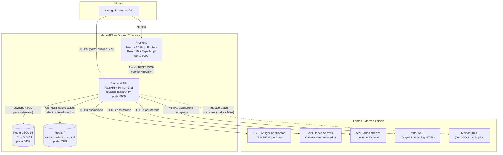

# 🛡️ Relatório de Estado Real e Auditoria Técnica — datapoliRS

> **Fonte:** leitura direta do código-fonte no repositório `datapoliRS` (branch `main`, HEAD `0e41870`, mais o diff de trabalho em curso — sistema de configuração dinâmica, refino de tenant/equipe e esteira de publicação GHCR).
> **Data da auditoria:** 23/08/2026 (atualização — substitui a versão de 22/08/2026).
> **Método:** inspeção do código-fonte, das migrations Alembic, dos arquivos de configuração (`docker-compose.yml`, `.github/workflows/ci.yml`, `.env.example`) e dos schemas Pydantic — sem inferência a partir de documentação anterior.
> **Nota de escopo:** este documento é a auditoria **viva** do estado real do sistema. O `RELATORIO_ENGENHARIA_REVERSA.md` é um snapshot histórico congelado do dia 17/08/2026 (arquitetura pré-PostgreSQL, mantido como registro do MVP original) e **não** deve ser confundido com este.

---

## 1. Resumo Executivo e Mapa de Funcionalidades Entregues

### Propósito Real do Sistema

O **datapoliRS** é uma plataforma de inteligência eleitoral e gestão de gabinete político para o Rio Grande do Sul. Coexistem dois sistemas no mesmo repositório:

1. **Portal Público de Consulta Eleitoral** — SPA vanilla JS/Leaflet servida pelo FastAPI em `/`, sem autenticação, com filtros de cargo/pleito carregados dinamicamente da API (não mais hardcoded).
2. **Gabinete Digital** — painel Next.js autenticado, multi-tenant, para gestão de lideranças políticas, emendas orçamentárias, projetos de lei e configuração da própria plataforma.

**Estágio de maturidade: MVP avançado / pré-homologação.** O núcleo de segurança (auth via cookie `HttpOnly`, RBAC, isolamento multi-tenant com FK real, migrations versionadas, rate limiting em **todos** os módulos incluindo login) está regularizado. Os módulos de negócio centrais — Lideranças, Emendas Orçamentárias, Projetos de Lei e Tarefas — estão codificados e operacionais, com paginação e busca reais tanto no backend quanto na UI. A tela de Configurações deixou de ser um stub: hoje tem 5 abas funcionais, incluindo uma tela de administração de parâmetros de plataforma em runtime.

### Matriz de Módulos & Features

**✅ Funcionalidades 100% codificadas e operacionais:**

| Módulo | Onde vive |
|---|---|
| Consulta pública de candidatos (multi-pleito, filtros carregados via API) | `app/static/index.html` + `script.js`, consumindo `/api/v1/cargos`, `/api/v1/eleicoes`, `/api/v1/candidatos` |
| Mapa coroplético de votação (Leaflet, portal público) | [app/static/script.js](app/static/script.js) |
| Autenticação (login/logout/me/troca de senha) via cookie `HttpOnly`, com rate limiting configurável | [app/routers/auth.py](app/routers/auth.py) |
| RBAC (admin/operador/leitor) | [app/core/dependencies.py:96](app/core/dependencies.py:96) (`require_role`) |
| Multi-tenancy com FK real (`tb_tenants`) | migration [a1961e63fbe4](alembic/versions/a1961e63fbe4_tb_tenants_e_fk_multi_tenant.py) |
| CRUD de Lideranças Políticas, com paginação, busca por nome e exclusão restrita a admin | [app/routers/cabinet.py](app/routers/cabinet.py), [LiderancasTable.tsx](frontend/src/features/liderancas/LiderancasTable.tsx) |
| Mapa Tático unificado — 3 modos (Lideranças / Votação / Visão Cruzada), com rótulo de ano de eleição dinâmico | [frontend/src/components/map/ElectionMap.tsx](frontend/src/components/map/ElectionMap.tsx) |
| Módulo de Emendas Orçamentárias — CRUD completo, KPIs agregados, paginação, filtros | [app/routers/amendments.py](app/routers/amendments.py), tela [/emendas](frontend/src/app/(dashboard)/emendas/page.tsx) |
| Módulo de Projetos de Lei — busca ao vivo em ALRS/Câmara/Senado, importação idempotente, observadores (lideranças) | [app/routers/legislative.py](app/routers/legislative.py), [app/services/legislative_sources.py](app/services/legislative_sources.py), tela [/projetos-lei](frontend/src/app/(dashboard)/projetos-lei/page.tsx) |
| Módulo de Tarefas — vinculadas a projeto de lei e/ou emenda, com responsável e prazo | [app/routers/tasks.py](app/routers/tasks.py) |
| Configurações do Gabinete — Perfil do Mandato, Equipe & Acessos, Preferências Táticas, Segurança & Dados, APIs & Sistema (5 abas) | [frontend/src/app/(dashboard)/settings/page.tsx](frontend/src/app/(dashboard)/settings/page.tsx) |
| **Configuração dinâmica de plataforma em runtime** (ciclo eleitoral, rate limiting, cache) — ver seção 5 | [app/routers/admin.py](app/routers/admin.py), [app/services/system_config_service.py](app/services/system_config_service.py) |
| Ciclo eleitoral não mais hardcoded — pronto para 2026 (ou qualquer pleito futuro) sem alterar código | `settings.ELECTION_YEAR` como *fallback*, sobrescrito por `tb_configuracoes_sistema` |
| Exportação de dados do gabinete (lideranças + emendas) em CSV com BOM | [app/routers/tenant.py:/exportar-dados](app/routers/tenant.py) |
| Migrations versionadas (Alembic) | `alembic/versions/` — 7 revisões aplicadas |
| CI/CD completo: testes backend+frontend, lint, typecheck, e2e, e publicação de imagens no GHCR | [.github/workflows/ci.yml](.github/workflows/ci.yml) |

**🟡 Funcionalidades parciais ou com ressalvas conhecidas:**

| Item | Estado |
|---|---|
| Fonte oficial da ALRS (Projetos de Lei) | Sem API pública documentada — scraping controlado de HTML server-side (Drupal 9), mais frágil que Câmara/Senado (API REST oficial) |
| Prestação de contas oficial (CEAP/CEAPS/emendas federais via CGU) | Levantado e validado na análise, mas fora do escopo deste MVP — API da CGU exige cadastro prévio de token |
| Papel `leitor` | Existe no `CHECK` constraint e é aceito por `require_role`, mas nenhuma rota o referencia explicitamente ainda — RBAC de 3 níveis incompleto na prática |
| `ds_cargo_mandato` (texto livre) em `tb_tenants` | Mantido em paralelo à nova FK `cd_cargo` por compatibilidade com o bootstrap; o serviço sincroniza os dois campos ao salvar, mas o schema ainda carrega o campo legado |

**❌ Funcionalidades não iniciadas:**

| Item | Observação |
|---|---|
| Nível municipal (Câmaras de Vereadores via SAPL) | Sem fonte única nem diretório de quais câmaras do RS expõem API — mapeamento manual necessário antes de integrar |
| Dashboard Executivo de KPIs consolidado | Não existe — a rota raiz do gabinete é o Mapa Tático; KPIs hoje só existem no escopo de Emendas |
| Refresh token | Login só emite access token de 60 min, sem renovação — usuário precisa logar de novo |
| Row Level Security (RLS) no PostgreSQL | Isolamento multi-tenant é 100% disciplina de código (`WHERE tenant_id = $1` manual em cada query) |

### Atores e Perfis de Acesso

| Perfil | Implementado? | Detalhe |
|---|---|---|
| Anônimo | ✅ | Acessa portal público e rotas `voting`/`geo`, sob rate limit configurável |
| Operador (autenticado) | ✅ | `role='operador'` — acesso total aos módulos de gabinete exceto operações restritas a admin |
| Admin | ✅ | `role='admin'` — acesso do operador + `DELETE` de liderança/emenda/projeto de lei, gestão de equipe, edição do perfil do mandato, exportação de dados e acesso à tela **APIs & Sistema** |
| Leitor | 🟡 | Aceito pelo `CHECK` constraint e pela API, mas nenhuma rota diferencia comportamento para este papel — role existe no schema sem uso funcional |

---

## 2. Topologia do Sistema e Modelo C4 Consolidado

### Árvore Física de Diretórios (resumida)

```
datapoliRS/
├── app/                          # Backend FastAPI (Python 3.11)
│   ├── core/                     # config, database, redis_client, dependencies (auth/RBAC),
│   │                             # bootstrap, rate_limit, exceptions
│   ├── routers/                  # camada HTTP: auth, tenant, admin, cabinet, amendments,
│   │                             # legislative, tasks, geo, voting
│   ├── services/                 # orquestração de negócio
│   ├── repositories/              # SQL parametrizado (asyncpg puro, sem ORM)
│   ├── schemas/                  # contratos Pydantic v2
│   └── static/                   # portal público (index.html, script.js)
├── alembic/versions/             # 7 migrations versionadas — fonte de verdade do schema
├── etl/                          # ingestão batch (DuckDB + psycopg2), fora do event loop da API
├── frontend/src/
│   ├── app/                      # Next.js 16 App Router — (auth)/login, (dashboard)/*
│   ├── features/                 # hooks + componentes por domínio (liderancas, emendas,
│   │                             # projetosLei, settings)
│   ├── components/map/           # ElectionMap.tsx (Leaflet, 3 modos táticos)
│   ├── services/api.ts           # cliente Axios
│   └── stores/useAuthStore.ts    # Zustand (estado de sessão em UI)
├── tests/                        # Pytest (backend) — 25 testes
├── frontend/{src/**/*.test.ts, e2e/}  # Vitest (unitário) + Playwright (e2e de fumaça)
├── sql/01_init_schema.sql        # legado — não é mais fonte de verdade (Alembic é)
└── .github/workflows/ci.yml      # CI (test + frontend) + CD (docker-publish → GHCR)
```

### Diagrama de Contêineres (Nível 2 — C4)



### Portas, Redes Docker e Variáveis de Ambiente

| Serviço | Porta host | Rede Docker | Healthcheck |
|---|---|---|---|
| `postgres` (`postgis/postgis:16-3.4`) | `5432` | `datapoli_network` (bridge) | `pg_isready` |
| `redis` (`redis:7-alpine`) | `6379` | `datapoli_network` | `redis-cli ping` |
| `api` (build local, `./Dockerfile`) | `8000` | `datapoli_network` | `curl -f localhost:8000/health` — comando de start roda `alembic upgrade head` antes do `uvicorn` |
| `frontend` (build local, `./frontend/Dockerfile`, `target: dev`) | `3000` | `datapoli_network` | sem healthcheck definido |

| Variável | Finalidade |
|---|---|
| `POSTGRES_USER/PASSWORD/DB/HOST/PORT` | Credenciais e endereço do Postgres |
| `DATABASE_URL` / `DATABASE_URL_DOCKER` | DSN completo (variante local vs. rede Docker) |
| `REDIS_HOST/PORT/URL` / `*_DOCKER` | Conexão Redis |
| `PORT` | Porta HTTP da API |
| `ENVIRONMENT` | Controla flag `Secure` do cookie e `--reload` |
| `ALLOWED_ORIGINS` | CORS (lista explícita, nunca `*`) |
| `SECRET_KEY` | Assinatura JWT — obrigatória, sem default |
| `ALGORITHM`, `ACCESS_TOKEN_EXPIRE_MINUTES` | Config JWT |
| `ADMIN_EMAIL`, `ADMIN_PASSWORD`, `ADMIN_TENANT_ID` | Bootstrap do admin — obrigatórias, sem default |
| `NEXT_PUBLIC_API_URL` | URL da API consumida pelo frontend |

---

## 3. Arquitetura do Frontend (Next.js 16 + Leaflet + Glassmorphism)

### Roteamento & Proteção

**Next.js 16.3.1** (App Router), **React 19.2.8**, **TypeScript 5**. Árvore de rotas:

```
frontend/src/app/
├── layout.tsx
├── (auth)/login/page.tsx              # "/login"
└── (dashboard)/
    ├── layout.tsx                     # sidebar + navegação + logout + restauração de sessão via /auth/me
    ├── page.tsx                       # "/" — Mapa Tático (3 modos)
    ├── liderancas/page.tsx            # "/liderancas" — CRUD paginado
    ├── emendas/page.tsx               # "/emendas" — CRUD + KPIs
    ├── projetos-lei/page.tsx          # "/projetos-lei" — busca externa + importação + tarefas
    └── settings/page.tsx              # "/settings" — 5 abas (ver abaixo)
```

Proteção de rota via [middleware.ts](frontend/src/middleware.ts): checa **presença** do cookie `token` (não valida assinatura — a validação real é delegada ao backend a cada request via `/auth/me`).

### Componentes Centrais

**`ElectionMap.tsx`** — renderiza os 3 modos táticos (Lideranças / Votação / Visão Cruzada) sobre Leaflet 1.9.4 (não MapLibre GL — migração feita por incompatibilidade de renderização WebGL no ambiente de dev). A preferência de modo é persistida em `localStorage` via [utils/tacticalPreferences.ts](frontend/src/utils/tacticalPreferences.ts). O rótulo do modo "Votação" é montado dinamicamente com o ano mais recente disponível (`GET /api/v1/eleicoes`), não mais hardcoded em "2022".

**`/settings` (5 abas):**

| Aba | Componente | Acesso | Conteúdo |
|---|---|---|---|
| Perfil do Mandato | [MandatoSettingsTab.tsx](frontend/src/features/settings/MandatoSettingsTab.tsx) | leitura: todos · edição: admin | Nome do mandato, cargo (FK `cd_cargo`), partido, município-base |
| Equipe & Acessos | [EquipeSettingsTab.tsx](frontend/src/features/settings/EquipeSettingsTab.tsx) | admin | Lista/convite/edição de papel e status de usuários do tenant |
| Preferências Táticas | [PreferenciasSettingsTab.tsx](frontend/src/features/settings/PreferenciasSettingsTab.tsx) | todos | Modo padrão do mapa, com rótulo de ano eleitoral dinâmico |
| Segurança & Dados | [SegurancaSettingsTab.tsx](frontend/src/features/settings/SegurancaSettingsTab.tsx) | todos (troca de senha) · admin (export) | Troca de senha própria, exportação CSV do gabinete |
| **APIs & Sistema** | [PlataformaSettingsTab.tsx](frontend/src/features/settings/PlataformaSettingsTab.tsx) | admin | 25 parâmetros globais de runtime — ver seção 5 |

Não-admins veem uma mensagem de acesso restrito (`ShieldAlert`) nas abas Equipe, Segurança (export) e APIs & Sistema, em vez de erro 403 silencioso.

### Gerenciamento de Estado & Hooks

| Item | Onde | Observação |
|---|---|---|
| `useAuthStore` | [stores/useAuthStore.ts](frontend/src/stores/useAuthStore.ts) | Zustand, sem persistência — estado de UI se perde em refresh, mas a sessão real (cookie) sobrevive e é restaurada via `/auth/me` no `layout.tsx` do dashboard |
| `useLiderancas`, `useEmendas`, `useProjetosLei`, `useSettings`, `usePlatformConfig` | `frontend/src/features/*/use*.ts` | Hooks de dados manuais (`useState` + `useEffect`), sem cache entre navegações; todo `setState` síncrono dentro de `useEffect` é adiado com `setTimeout(…, 0)` para satisfazer a regra `react-hooks/set-state-in-effect` do React Compiler |
| `api` (Axios) | [services/api.ts](frontend/src/services/api.ts) | `baseURL` de `NEXT_PUBLIC_API_URL`, `withCredentials: true`; interceptor de resposta força logout em `401`/`403` |

### Tratamento de Dados e Cache

- **Sem SWR/React Query** — todo fetch é manual via `useEffect` + `useState`.
- **Sem deduplicação de requisições** — trocar de candidato rapidamente pode disparar múltiplos fetches concorrentes sem cancelamento (`AbortController` não é usado).
- **Paginação real** em Lideranças, Emendas e Projetos de Lei — backend e UI expõem `page`/`page_size` com controles de navegação (Sprint 3.2), substituindo o antigo paliativo `page_size=200` fixo.

### Bibliotecas Visuais

- **Mapa:** `leaflet` 1.9.4 + `@types/leaflet`.
- **Estilo:** Tailwind CSS v4 (`@tailwindcss/postcss`), padrão visual "glassmorphism".
- **Animação:** Framer Motion.
- **Ícones:** `lucide-react`.
- A dependência de tipos órfã `@types/maplibre-gl` (resquício da migração para Leaflet) **foi removida** de `package.json` — item de débito técnico já sanado.

---

## 4. Arquitetura do Backend (Camada de Aplicação e APIs)

### Estrutura de Camadas

```
app/
├── main.py                # entry point, lifespan (warm-up de cache), CORS, mount de rotas
├── core/                  # config, database, redis, dependencies (auth/RBAC), bootstrap,
│                           # rate_limit (com resolução dinâmica via configKey), exceptions
├── routers/                # camada HTTP: auth, tenant, admin, cabinet, amendments,
│                           # legislative, tasks, geo, voting
├── services/                # orquestração — auth, tenant, team, cabinet, amendment,
│                           # legislative (+ legislative_sources: adapters), tse, voting,
│                           # geo, system_config
├── repositories/            # SQL parametrizado — user, tenant, cabinet, candidate,
│                           # geo, voting, amendment, legislative, task, system_config
└── schemas/                # contratos Pydantic v2
```

A separação routers → services → repositories é consistente em todos os módulos de negócio. **O módulo `auth`** mantém SQL direto em `routers/auth.py`/`core/dependencies.py` (sem repository próprio para `tb_users`, exceto o `UserRepository` novo usado por `team_service.py` para operações de gestão de equipe) — divergência arquitetural conhecida e de baixa severidade.

### Catálogo Completo de Endpoints REST

**`app/main.py` (raiz, sem prefixo de router):**

| Método | Rota | Descrição | Auth | Rate Limit |
|---|---|---|---|---|
| `GET` | `/` | Serve o SPA público | Nenhuma | — |
| `GET` | `/health` | Healthcheck | Nenhuma | — |
| `GET` | `/api/v1/candidatas/rs` | Consulta TSE ao vivo (legado, compat.) | Nenhuma | — |
| `GET` | `/api/v1/candidatas/{numero}/votos` | Votos por número (legado, agora via Postgres) | Nenhuma | — |

**[app/routers/auth.py](app/routers/auth.py) — prefixo `/api/v1/auth`:**

| Método | Rota | Auth | Rate Limit (`configKey`) |
|---|---|---|---|
| `POST` | `/login` | Nenhuma | `login` — 5/60s |
| `POST` | `/logout` | Cookie/Bearer | — |
| `GET` | `/me` | Cookie/Bearer | — |
| `POST` | `/trocar-senha` | Cookie/Bearer | `trocar_senha` — 5/60s |

**[app/routers/voting.py](app/routers/voting.py) — prefixo `/api/v1`, rate limit padrão do router `voting` — 20/1s:**

| Método | Rota | Descrição |
|---|---|---|
| `GET` | `/candidatos/{sq_candidato}/foto` | Proxy resiliente de foto TSE com fallback SVG |
| `GET` | `/cargos` | Lista cargos eletivos disponíveis (cache `cache_ttl.cargos`) |
| `GET` | `/eleicoes` | Lista pleitos com dados carregados, mais recente primeiro (cache `cache_ttl.eleicoes`) |
| `GET` | `/candidatos` | Busca multi-cargo com filtros (`termo, cd_cargo, sg_partido, nr_candidato, ano, limite`) |
| `GET` | `/votacao/candidatos/{sq_candidato}/municipios` | Votos por município via SQ (cache `cache_ttl.candidate_votes`) |
| `GET` | `/votacao/numero/{numero_urna}` | Votos por número de urna (`cd_cargo, ano` opcionais) |

**[app/routers/geo.py](app/routers/geo.py) — prefixo `/api/v1/geo`, rate limit padrão do router `geo` — 30/1s:**

| Método | Rota | Descrição |
|---|---|---|
| `GET` | `/municipios` | GeoJSON completo dos 496 municípios (cache `cache_ttl.geojson_municipios`) |
| `GET` | `/municipios/lista` | Lista leve com centróide |

**[app/routers/cabinet.py](app/routers/cabinet.py) — prefixo `/api/v1/gabinete/liderancas`, JWT obrigatório, rate limit `cabinet` — 30/1s:**

| Método | Rota | RBAC |
|---|---|---|
| `POST` | `` | qualquer autenticado |
| `GET` | `` | qualquer autenticado (paginado: `page, page_size, cd_ibge_7, tp_influencia, is_ativo, termo`) |
| `GET` | `/{id_lideranca}` | qualquer autenticado |
| `PUT` | `/{id_lideranca}` | qualquer autenticado |
| `DELETE` | `/{id_lideranca}` | **admin** |

**[app/routers/amendments.py](app/routers/amendments.py) — prefixo `/api/v1/gabinete/emendas`, JWT obrigatório, rate limit `amendments` — 30/1s:**

| Método | Rota | RBAC |
|---|---|---|
| `POST` | `` | qualquer autenticado |
| `GET` | `/kpis` | qualquer autenticado (`ano_exercicio` opcional) |
| `GET` | `` | qualquer autenticado (paginado + filtros: `cd_ibge_7, ano_exercicio, tp_situacao, termo`) |
| `GET` | `/{id_emenda}` | qualquer autenticado |
| `PUT` | `/{id_emenda}` | qualquer autenticado |
| `DELETE` | `/{id_emenda}` | **admin** |

**[app/routers/legislative.py](app/routers/legislative.py) — prefixo `/api/v1/gabinete/projetos-lei`, JWT obrigatório, rate limit `legislative` — 30/1s:**

| Método | Rota | RBAC |
|---|---|---|
| `GET` | `/buscar-externo` | qualquer autenticado (`nome`, agrega ALRS+Câmara+Senado) |
| `POST` | `` | qualquer autenticado (importação idempotente) |
| `GET` | `` | qualquer autenticado (paginado + filtros: `termo, fonte`) |
| `GET` | `/{id_projeto_lei}` | qualquer autenticado |
| `DELETE` | `/{id_projeto_lei}` | **admin** |
| `GET` | `/{id_projeto_lei}/observadores` | qualquer autenticado |
| `POST` | `/{id_projeto_lei}/observadores` | qualquer autenticado |
| `DELETE` | `/{id_projeto_lei}/observadores/{id_lideranca}` | qualquer autenticado |

**[app/routers/tasks.py](app/routers/tasks.py) — prefixo `/api/v1/gabinete/tarefas`, JWT obrigatório, rate limit `tasks` — 30/1s:**

| Método | Rota | RBAC |
|---|---|---|
| `POST` | `` | qualquer autenticado |
| `GET` | `` | qualquer autenticado (`id_projeto_lei`, `id_emenda` opcionais) |
| `PUT` | `/{id_tarefa}` | qualquer autenticado |
| `DELETE` | `/{id_tarefa}` | qualquer autenticado |

**[app/routers/tenant.py](app/routers/tenant.py) — prefixo `/api/v1/gabinete`, JWT obrigatório, rate limit `tenant` — 30/1s:**

| Método | Rota | RBAC |
|---|---|---|
| `GET` | `/perfil` | qualquer autenticado |
| `PUT` | `/perfil` | **admin** |
| `GET` | `/perfil/opcoes` | qualquer autenticado (listas de apoio: cargos, partidos, municípios) |
| `GET` | `/usuarios` | **admin** |
| `POST` | `/usuarios` | **admin** |
| `PATCH` | `/usuarios/{id_user}` | **admin** |
| `GET` | `/exportar-dados` | **admin** (CSV com BOM) |

**[app/routers/admin.py](app/routers/admin.py) — prefixo `/api/v1/admin`, JWT obrigatório, rate limit fixo 10/1s (deliberadamente **sem** `configKey` próprio, para não criar autorreferência):**

| Método | Rota | RBAC |
|---|---|---|
| `GET` | `/configuracoes` | **admin** — lista as 25 configurações globais |
| `PUT` | `/configuracoes` | **admin** — atualiza em lote, aplica imediatamente |

### Injeção de Dependências e Middlewares

- **DB:** `Depends(getDbConnection)` — conexão do pool `asyncpg` por request.
- **Auth:** `Depends(get_current_user)` decodifica JWT (cookie ou header `Authorization: Bearer`, este último usado nos testes), revalida `is_active` contra o banco a cada request. `Depends(require_role([...]))` (dependency factory) para RBAC.
- **CORS:** lista explícita via `ALLOWED_ORIGINS`, nunca `*` — obrigatório para o cookie `HttpOnly` funcionar cross-origin.
- **Erros globais (RFC 7807):** `UniqueViolationError`→409, `ForeignKeyViolationError`→422, `DomainException`→configurável, catch-all→500 ([app/core/exceptions.py](app/core/exceptions.py)).
- **Rate limiting:** Redis fixed-window, fail-open se Redis cair, aplicado em **todos** os routers, incluindo `auth/login` e `auth/trocar-senha` (corrigido — antes login não tinha proteção nenhuma). Cada `RateLimiter` aceita um `configKey` opcional que resolve `times`/`seconds` a partir do cache de configuração em runtime (ver seção 5), com fallback para os valores fixos do construtor se a configuração não estiver disponível.

---

## 5. Mecanismo de Configuração Dinâmica em Runtime

### O problema que resolve

Até esta sessão, o ano do pleito (`2022`), o código do TSE do pleito, o cargo padrão de busca, os limites de rate limiting de cada módulo e o TTL de cada cache Redis eram **constantes fixas no código-fonte** (`app/core/config.py` e literais espalhados nos serviços). Trocar de pleito (ex.: 2022 → 2026) ou afinar um limite de API exigia alterar código e fazer novo deploy.

### Como funciona

1. **`tb_configuracoes_sistema`** (migration [b0361677db37](alembic/versions/b0361677db37_tb_configuracoes_sistema.py)) — tabela chave/valor global (não é `tenant_id`-scoped; é compartilhada por toda a instância):
   ```sql
   CREATE TABLE tb_configuracoes_sistema (
       chave VARCHAR(80) PRIMARY KEY,
       valor TEXT NOT NULL,
       tipo VARCHAR(20) NOT NULL DEFAULT 'string',
       categoria VARCHAR(30) NOT NULL,
       descricao VARCHAR(255) NOT NULL,
       updated_at TIMESTAMP WITH TIME ZONE DEFAULT NOW()
   );
   ```
2. **[SystemConfigService](app/services/system_config_service.py)** carrega todas as chaves numa única leitura, cacheada em Redis (`system:config:all`, TTL de **60 segundos**). `getInt`/`getStr` leem do cache-ou-banco; `getIntFromCacheOnly` (usado pelo `RateLimiter`, caminho de alta frequência) lê **só** do Redis, sem abrir conexão de banco, e retorna o default do construtor se o cache ainda não foi aquecido.
3. **Invalidação:** todo `PUT /api/v1/admin/configuracoes` apaga a chave de cache imediatamente após persistir — a próxima leitura (em até poucos milissegundos) já reflete o novo valor, sem esperar o TTL expirar e **sem reiniciar o processo**.
4. **Warm-up:** o `lifespan` do FastAPI ([app/main.py:46-48](app/main.py:46)) aquece o cache no startup, para que a primeira requisição já encontre os valores atuais.
5. **Validação de escrita:** `SystemConfigService.updateMany` rejeita com `400` chaves desconhecidas e valores não-numéricos para chaves `tipo='int'`, antes de persistir.

### Os 25 parâmetros editáveis

| Categoria | Quantidade | Exemplos de chave |
|---|---|---|
| `eleitoral` | 3 | `eleitoral.election_year` (padrão `2022`, pronto para virar `2026`), `eleitoral.tse_codigo_eleicao`, `eleitoral.default_cargo_code` |
| `rate_limit` | 18 (9 pares times/seconds) | `rate_limit.login.times/seconds`, `rate_limit.cabinet.*`, `rate_limit.amendments.*`, `rate_limit.legislative.*`, `rate_limit.geo.*`, `rate_limit.voting.*`, `rate_limit.tenant.*`, `rate_limit.tasks.*`, `rate_limit.trocar_senha.*` |
| `cache` | 4 | `cache_ttl.candidate_votes` (86400s), `cache_ttl.cargos` (2592000s), `cache_ttl.eleicoes` (3600s), `cache_ttl.geojson_municipios` (604800s) |

### Acesso e UI

Tela **"APIs & Sistema"** dentro de Configurações (aba 5, admin-only), via [PlataformaSettingsTab.tsx](frontend/src/features/settings/PlataformaSettingsTab.tsx) + hook [usePlatformConfig.ts](frontend/src/features/settings/usePlatformConfig.ts) — renderiza as 25 chaves agrupadas por categoria com um aviso explícito de que a mudança é **global à instância**, não apenas ao gabinete do usuário logado. Qualquer papel `admin` de qualquer tenant pode alterar — decisão de escopo confirmada com o usuário (instância de uso único hoje, "Deputada RS", com plano de escalar para múltiplos gabinetes).

**Validado end-to-end nesta sessão:** troca do `rate_limit.login.times` de 5→3 refletiu em `429` já na 4ª tentativa sem restart; troca do `eleitoral.election_year` para `2026` mudou o resultado de busca de candidatos imediatamente; ambos revertidos após o teste. RBAC testado ao vivo (operador bloqueado, admin com acesso pleno).

---

## 6. Engenharia de Dados, DER e Histórico de Migrations Alembic

### Linha do Tempo de Migrations

| # | Revisão | Nome | Data |
|---|---|---|---|
| 1 | `a099af5414b9` | baseline_schema | 22/08/2026 |
| 2 | `a1961e63fbe4` | tb_tenants_e_fk_multi_tenant | 22/08/2026 |
| 3 | `ba54000227b6` | role_rbac_em_tb_users | 22/08/2026 |
| 4 | `1dac719b2ee7` | tb_gabinete_emendas_orcamentarias | 23/08/2026 |
| 5 | `fb903633c34c` | tb_gabinete_projetos_lei_observadores_e_tarefas | 23/08/2026 |
| 6 | `ae5bbe065aec` | cd_cargo_em_tb_tenants | 24/08/2026 |
| 7 | `b0361677db37` | tb_configuracoes_sistema | 24/08/2026 |

`sql/01_init_schema.sql` ainda existe (bind-mount `docker-entrypoint-initdb.d` do Postgres em container novo) mas **não é mais a fonte de verdade do schema** — Alembic é, e a migration baseline é idempotente (`IF NOT EXISTS` em tudo) para funcionar em qualquer um dos dois cenários.

### DDL Físico das Tabelas Ativas

**Núcleo eleitoral (baseline):**

```sql
CREATE TABLE tb_eleicoes (
    cd_eleicao VARCHAR(20) PRIMARY KEY,
    ano_eleicao INT NOT NULL,
    nr_turno INT NOT NULL DEFAULT 1,
    tp_abrangencia VARCHAR(10) NOT NULL,
    ds_eleicao VARCHAR(150) NOT NULL,
    dt_eleicao DATE NOT NULL,
    created_at TIMESTAMP WITH TIME ZONE DEFAULT CURRENT_TIMESTAMP
);

CREATE TABLE tb_municipios (
    cd_ibge_7 VARCHAR(7) PRIMARY KEY,
    cd_tse VARCHAR(10) UNIQUE,
    nm_municipio VARCHAR(150) NOT NULL,
    sg_uf CHAR(2) NOT NULL DEFAULT 'RS',
    geometria GEOMETRY(MultiPolygon, 4326),
    created_at TIMESTAMP WITH TIME ZONE DEFAULT CURRENT_TIMESTAMP
);
CREATE INDEX idx_municipios_geom ON tb_municipios USING GIST(geometria);  -- índice espacial

CREATE TABLE tb_partidos (nr_partido INT PRIMARY KEY, sg_partido VARCHAR(20) NOT NULL, nm_partido VARCHAR(150) NOT NULL);
CREATE TABLE tb_cargos (cd_cargo INT PRIMARY KEY, ds_cargo VARCHAR(100) NOT NULL);

CREATE TABLE tb_candidaturas (
    sq_candidato BIGINT PRIMARY KEY,
    id_tse BIGINT,
    cd_eleicao VARCHAR(20) NOT NULL REFERENCES tb_eleicoes(cd_eleicao),
    cd_cargo INT NOT NULL REFERENCES tb_cargos(cd_cargo),
    nr_candidato INT NOT NULL,
    nm_candidato VARCHAR(255) NOT NULL,
    nm_urna_candidato VARCHAR(150) NOT NULL,
    nr_partido INT NOT NULL REFERENCES tb_partidos(nr_partido),
    sg_uf CHAR(2) NOT NULL DEFAULT 'RS',
    ds_situacao_candidatura VARCHAR(50),
    ds_detalhe_situacao VARCHAR(100),
    st_reeleicao BOOLEAN DEFAULT FALSE,
    vl_total_bens NUMERIC(15, 2) DEFAULT 0.00,
    foto_url TEXT,
    created_at TIMESTAMP WITH TIME ZONE DEFAULT CURRENT_TIMESTAMP
);

CREATE TABLE tb_bens_candidatos (
    id_bem UUID PRIMARY KEY DEFAULT uuid_generate_v4(),
    sq_candidato BIGINT NOT NULL REFERENCES tb_candidaturas(sq_candidato) ON DELETE CASCADE,
    ds_tipo_bem VARCHAR(150), ds_detalhe_bem TEXT,
    vl_declarado NUMERIC(15, 2) NOT NULL DEFAULT 0.00
);

CREATE TABLE tb_fato_votacao_munzona (
    id_fato BIGSERIAL PRIMARY KEY,
    cd_eleicao VARCHAR(20) NOT NULL REFERENCES tb_eleicoes(cd_eleicao),
    sq_candidato BIGINT NOT NULL REFERENCES tb_candidaturas(sq_candidato),
    cd_tse_municipio VARCHAR(10) NOT NULL,
    cd_ibge_7 VARCHAR(7) REFERENCES tb_municipios(cd_ibge_7),
    nr_zona INT NOT NULL,
    qt_votos_nominais INT NOT NULL DEFAULT 0,
    qt_votos_validos INT NOT NULL DEFAULT 0,
    CONSTRAINT unq_eleicao_cand_mun_zona UNIQUE (cd_eleicao, sq_candidato, cd_tse_municipio, nr_zona)
);
```

**Multi-tenancy, usuários e RBAC:**

```sql
CREATE TABLE tb_tenants (
    id_tenant UUID PRIMARY KEY DEFAULT gen_random_uuid(),
    nm_mandato VARCHAR(150) NOT NULL,
    ds_cargo_mandato VARCHAR(50) NOT NULL,       -- legado, mantido em sincronia com cd_cargo
    cd_cargo INT REFERENCES tb_cargos(cd_cargo), -- adicionado em ae5bbe065aec
    nr_partido INT REFERENCES tb_partidos(nr_partido),
    cd_ibge_base VARCHAR(7) REFERENCES tb_municipios(cd_ibge_7),
    is_ativo BOOLEAN DEFAULT TRUE,
    created_at TIMESTAMP WITH TIME ZONE DEFAULT NOW()
);

CREATE TABLE tb_users (
    id UUID PRIMARY KEY DEFAULT uuid_generate_v4(),
    tenant_id UUID NOT NULL REFERENCES tb_tenants(id_tenant) ON DELETE RESTRICT,
    email VARCHAR(255) UNIQUE NOT NULL,
    hashed_password VARCHAR(255) NOT NULL,
    is_active BOOLEAN DEFAULT TRUE,
    role VARCHAR(20) NOT NULL DEFAULT 'operador',  -- adicionado em ba54000227b6
    CONSTRAINT ck_users_role CHECK (role IN ('admin', 'operador', 'leitor')),
    created_at TIMESTAMP WITH TIME ZONE DEFAULT CURRENT_TIMESTAMP
);

CREATE TABLE tb_gabinete_liderancas (
    id_lideranca UUID PRIMARY KEY DEFAULT uuid_generate_v4(),
    tenant_id UUID NOT NULL REFERENCES tb_tenants(id_tenant) ON DELETE CASCADE,
    cd_ibge_7 VARCHAR(7) REFERENCES tb_municipios(cd_ibge_7),
    nm_completo VARCHAR(255) NOT NULL,
    nr_telefone VARCHAR(30), ds_email VARCHAR(255),
    tp_influencia VARCHAR(50), ds_observacoes TEXT,
    is_ativo BOOLEAN DEFAULT TRUE,
    created_at TIMESTAMP WITH TIME ZONE DEFAULT CURRENT_TIMESTAMP
);
```

**Módulos de negócio (Emendas, Projetos de Lei, Tarefas):**

```sql
CREATE TABLE tb_gabinete_emendas (
    id_emenda UUID PRIMARY KEY DEFAULT gen_random_uuid(),
    tenant_id UUID NOT NULL REFERENCES tb_tenants(id_tenant) ON DELETE CASCADE,
    cd_ibge_7 VARCHAR(7) REFERENCES tb_municipios(cd_ibge_7),
    nr_emenda VARCHAR(50), ano_exercicio INT NOT NULL, tp_emenda VARCHAR(30),
    ds_area VARCHAR(100), ds_objeto TEXT NOT NULL,
    vl_indicado NUMERIC(14, 2) NOT NULL DEFAULT 0,
    vl_empenhado NUMERIC(14, 2) NOT NULL DEFAULT 0,
    vl_pago NUMERIC(14, 2) NOT NULL DEFAULT 0,
    tp_situacao VARCHAR(30) NOT NULL DEFAULT 'Indicada',
    ds_observacoes TEXT, created_at TIMESTAMP WITH TIME ZONE DEFAULT NOW()
);

CREATE TABLE tb_gabinete_projetos_lei (
    id_projeto_lei UUID PRIMARY KEY DEFAULT gen_random_uuid(),
    tenant_id UUID NOT NULL REFERENCES tb_tenants(id_tenant) ON DELETE CASCADE,
    fonte VARCHAR(20) NOT NULL,               -- 'ALRS' | 'CAMARA' | 'SENADO'
    identificador_externo VARCHAR(120) NOT NULL,
    tipo VARCHAR(20), numero VARCHAR(20), ano INT,
    ementa TEXT NOT NULL, situacao TEXT, autor VARCHAR(255), url_fonte TEXT,
    data_apresentacao DATE, created_at TIMESTAMP WITH TIME ZONE DEFAULT NOW(),
    UNIQUE (tenant_id, fonte, identificador_externo)  -- garante importação idempotente
);

CREATE TABLE tb_gabinete_projeto_lei_observadores (
    id_projeto_lei UUID NOT NULL REFERENCES tb_gabinete_projetos_lei(id_projeto_lei) ON DELETE CASCADE,
    id_lideranca UUID NOT NULL REFERENCES tb_gabinete_liderancas(id_lideranca) ON DELETE CASCADE,
    created_at TIMESTAMP WITH TIME ZONE DEFAULT NOW(),
    PRIMARY KEY (id_projeto_lei, id_lideranca)
);

CREATE TABLE tb_gabinete_tarefas (
    id_tarefa UUID PRIMARY KEY DEFAULT gen_random_uuid(),
    tenant_id UUID NOT NULL REFERENCES tb_tenants(id_tenant) ON DELETE CASCADE,
    id_projeto_lei UUID REFERENCES tb_gabinete_projetos_lei(id_projeto_lei) ON DELETE CASCADE,
    id_emenda UUID REFERENCES tb_gabinete_emendas(id_emenda) ON DELETE CASCADE,
    id_lideranca_responsavel UUID REFERENCES tb_gabinete_liderancas(id_lideranca),
    titulo VARCHAR(255) NOT NULL, descricao TEXT, prazo DATE,
    tp_status VARCHAR(20) NOT NULL DEFAULT 'Pendente',
    created_at TIMESTAMP WITH TIME ZONE DEFAULT NOW()
);
```

**Configuração de plataforma:** ver DDL completo de `tb_configuracoes_sistema` na seção 5.

### Resumo de Índices Notáveis

| Tabela | Índices |
|---|---|
| `tb_municipios` | `idx_municipios_geom` (**GIST**, espacial), `idx_municipios_nome`, `idx_municipios_tse` |
| `tb_candidaturas` | `idx_cand_numero_eleicao`, `idx_cand_nome_urna`, `idx_cand_partido` |
| `tb_fato_votacao_munzona` | `idx_fato_cand_mun`, `idx_fato_ibge`, `UNIQUE(cd_eleicao,sq_candidato,cd_tse_municipio,nr_zona)` |
| `tb_gabinete_liderancas` | `idx_liderancas_tenant`, `idx_liderancas_municipio` |
| `tb_gabinete_emendas` | `idx_emendas_tenant`, `idx_emendas_municipio`, `idx_emendas_ano`, `idx_emendas_situacao` |
| `tb_gabinete_projetos_lei` | `idx_projetos_lei_tenant`, `UNIQUE(tenant_id,fonte,identificador_externo)` |
| `tb_gabinete_tarefas` | `idx_tarefas_tenant`, `idx_tarefas_projeto_lei`, `idx_tarefas_emenda` |

PostGIS confirmado ativo (`spatial_ref_sys` presente, `GEOMETRY(MultiPolygon,4326)` em `tb_municipios.geometria`).

### Motores Analíticos / Ingestão em Lote

- **DuckDB** é usado **exclusivamente como motor de ETL batch** ([etl/ingest_tse.py](etl/ingest_tse.py)) — lê o CSV bruto do TSE via `read_csv` preguiçoso, agrega e persiste em lote (`execute_values`, batch 10.000) no PostgreSQL via `psycopg2` síncrono. **Roda fora do event loop da API**, só via `make etl-tse`.
- Em runtime, a API **nunca** toca em CSV/arquivos — tudo já foi ingerido no Postgres.
- **Redis** é cache-aside (não é fonte de dados): GeoJSON de municípios, votação por candidato, lista de cargos e lista de pleitos, todos com TTL agora **configurável em runtime** (seção 5). `cabinet`, `amendments`, `legislative`, `tasks`, `tenant` e `auth` **nunca** usam cache — sempre Postgres direto.

---

## 7. Segurança, Multi-Tenancy e Conformidade (LGPD)

### Isolamento Multi-Tenant

- **`tenant_id` é FK real** para `tb_tenants` desde a migration `a1961e63fbe4`.
- **Nunca vem do cliente**: extraído do JWT decodificado (`current_user.tenant_id`) em toda rota de negócio. O cliente não pode forjar `tenant_id` via URL/body.
- **Isolamento é disciplina de código**, não Row Level Security do PostgreSQL — cada método do repositório inclui manualmente `WHERE tenant_id = $1`. Um novo endpoint escrito sem essa disciplina vazaria dados entre tenants sem barreira estrutural do banco.
- `fk_lideranca_tenant`, `fk_emendas_tenant`, `fk_projetos_lei_tenant`, `fk_tarefas_tenant` são `ON DELETE CASCADE`; `fk_user_tenant` é `ON DELETE RESTRICT` (não deixa apagar tenant com usuários) — coerente.
- **`tb_configuracoes_sistema` é a única tabela deliberadamente global** (sem `tenant_id`) — qualquer admin de qualquer gabinete a altera para toda a instância, decisão de produto confirmada nesta sessão.

### Ciclo de Autenticação & JWT

- **Algoritmo:** HS256, `SECRET_KEY` obrigatória (sem default — falha o startup se ausente).
- **Payload:** `{sub: email, tenant_id: <uuid>, exp}` — sem `role` no token (o papel é buscado do banco a cada request via `get_current_user`, não confiado do JWT).
- **Transporte:** cookie `HttpOnly; SameSite=Lax; Secure` (apenas em produção) — não `localStorage`/Bearer no cliente (Bearer só é aceito como fallback nos testes automatizados).
- **Validade:** 60 min, sem refresh token.
- **Revalidação:** a cada request, `get_current_user` consulta `tb_users` — usuário desativado (`is_active=false`) perde acesso imediatamente mesmo com token ainda válido.
- **Rate limiting em `login` e `trocar-senha`** (5 tentativas/60s, ambos configuráveis em runtime) — item que era o principal risco de força bruta na auditoria anterior, corrigido.

### Privacidade & LGPD

- **PII armazenado:** `tb_gabinete_liderancas.nm_completo`, `nr_telefone`, `ds_email`, `ds_observacoes` (texto livre). **Sem CPF, endereço completo ou filiação partidária** no schema atual.
- **Sem criptografia em coluna** — todo PII é texto puro no Postgres; a proteção depende do isolamento de rede/acesso ao banco.
- **Sem trilha de auditoria** de quem acessou/alterou dados de terceiros, sem soft-delete (o `DELETE` é físico).
- **Nenhum mecanismo de consentimento** implementado.
- **Conclusão:** abaixo do mínimo esperado para LGPD em produção real com dados de terceiros — item recorrente das auditorias anteriores, ainda não endereçado.

---

## 8. Adaptadores de Fontes Externas e Resiliência

[app/services/legislative_sources.py](app/services/legislative_sources.py) implementa três adapters independentes, todos assíncronos (HTTPX), agregados por `buscar_em_todas_fontes(nome)`:

| Adapter | Fonte | Natureza | Observações de resiliência |
|---|---|---|---|
| `CamaraAdapter` | API Dados Abertos da Câmara dos Deputados | REST oficial, JSON | `buscar_por_nome` e `buscar_detalhe` tipados; contrato estável |
| `SenadoAdapter` | API Dados Abertos do Senado Federal | REST oficial, JSON | Guardas explícitas de tipo e de ementa nula — o Senado às vezes retorna campos ausentes/nulos que os outros dois adapters sempre preenchem |
| `AlrsAdapter` | Portal da Assembleia Legislativa do RS | **Scraping de HTML** (Drupal 9) | Sem API pública documentada — o mais frágil dos três, sujeito a quebrar se o portal mudar de template |

**`app/routers/legislative.py:/buscar-externo`** chama os três em paralelo e marca quais proposições já foram importadas pelo tenant atual, antes de exibir ao usuário. **`POST /projetos-lei`** revalida ementa/situação direto na fonte oficial no momento da importação (não confia em dado potencialmente desatualizado da busca), e persiste de forma idempotente via `UNIQUE(tenant_id, fonte, identificador_externo)` — reimportar a mesma proposição não duplica.

**Proxy de fotos:** `GET /api/v1/candidatos/{sq}/foto` busca a foto oficial em `divulgacandcontas.tse.jus.br`, com fallback para um avatar SVG gerado inline se o TSE retornar erro ou vier vazio — nunca quebra a UI por indisponibilidade da fonte externa.

**Malha cartográfica IBGE:** ingerida uma única vez via ETL batch (não em runtime) — a API nunca depende da disponibilidade do IBGE para responder `GET /api/v1/geo/municipios`.

---

## 9. Infraestrutura, Docker & Configurações de Ambiente

### Containerização

`docker-compose.yml` — 4 serviços na rede `datapoli_network` (ver tabela completa na seção 2). Volumes de hot-reload no `api` incluem `./alembic` e `./alembic.ini` (migrations editáveis sem rebuild). Frontend usa volumes anônimos para `node_modules`/`.next` (evita o host sobrescrever o install do container) e agora tem **Dockerfile multi-stage**: alvo `dev` (usado pelo `docker-compose.yml` local, comportamento de sempre) e alvo `production` (build otimizado do Next.js com `output: "standalone"`, usuário não-root, sem bind mounts) — usado exclusivamente pela esteira de CD.

### Suíte de Testes

- **Backend:** `pytest` — **25 testes** em 5 arquivos: `test_qa.py` (3), `test_sprint2_endpoints.py` (7), `test_tenant_settings.py` (8), `test_tse_service.py` (3), `test_system_config.py` (4 — RBAC da tela de admin, aplicação e reversão de valor em runtime, rejeição de valor inválido, rejeição de chave desconhecida). **25/25 passando** contra Postgres/Redis reais.
- **Frontend:** **Vitest** (`useLiderancas.test.ts`, unitário) + **Playwright** (`e2e/auth.spec.ts`, fumaça e2e) — ambos configurados e rodando no CI; item que era "nenhum teste automatizado" na auditoria anterior está resolvido.
- **CI:** [.github/workflows/ci.yml](.github/workflows/ci.yml) — job `test` sobe Postgres+Redis como services e roda `alembic upgrade head` **antes** do Pytest (a divergência CI vs. Alembic apontada na auditoria anterior foi corrigida — CI agora testa as migrations reais, não mais `sql/01_init_schema.sql`). Job `frontend`: `npm ci` → `lint` → `next typegen` → `tsc --noEmit` → Vitest → Playwright (Chromium).

### Esteira de CD — Publicação GHCR

Novo job `docker-publish` em `ci.yml`, condicionado a `needs: [test, frontend]` e a push em `main` (não roda em PR):

- Constrói e publica `ghcr.io/ctdol/datapolirs-api` (Dockerfile raiz) e `ghcr.io/ctdol/datapolirs-frontend` (`frontend/Dockerfile`, `target: production`).
- Autenticação via `GITHUB_TOKEN` (permissão `packages: write`), sem segredo adicional a gerenciar.
- Tags: `latest` + SHA longo do commit.
- Cache de build via GitHub Actions (`type=gha`), com escopo por imagem — builds subsequentes reaproveitam camadas.

---

## 10. Diagnóstico de Débitos Técnicos, Gargalos e Riscos

### Code & Architecture Drifts

| Item | Detalhe | Severidade |
|---|---|---|
| Módulo `auth` sem repository dedicado | SQL direto em `routers/auth.py`/`core/dependencies.py`, quebra o padrão do resto do código (que já tem `UserRepository` para o fluxo de equipe) | 🟢 Baixa |
| `ds_cargo_mandato` duplicado com `cd_cargo` em `tb_tenants` | Campo legado mantido por compatibilidade com o bootstrap; todo escritor precisa lembrar de sincronizar os dois | 🟢 Baixa |
| Papel `leitor` sem uso | Existe no `CHECK` constraint e na API (`require_role` aceita a string), mas nenhuma rota o referencia — RBAC de 3 níveis incompleto na prática | 🟢 Baixa |
| `RateLimiter` do `admin.py` não usa `configKey` | Decisão deliberada (evitar que a tela que edita rate limits seja ela mesma dinamicamente limitada por um valor editado através dela) — documentado no código, não é dívida, mas é uma exceção ao padrão que merece nota caso um novo endpoint admin seja adicionado | 🟢 Baixa |

### Vulnerabilidades de Segurança

- ✅ **Sem SQL Injection** — todas as queries usam parâmetros posicionais (`$1, $2...`).
- ✅ **CORS restrito**, nunca `*`.
- ✅ **Cookie `HttpOnly`** para o JWT.
- ✅ **Rate limiting em `login`/`trocar-senha`** — corrigido desde a auditoria anterior.
- 🟡 **Sem RLS no banco** — isolamento multi-tenant depende 100% de disciplina de código, sem barreira estrutural do PostgreSQL.
- 🟡 **Sem criptografia de PII em repouso** e sem trilha de auditoria (relevante para LGPD).
- 🟡 **`tb_configuracoes_sistema` acessível a qualquer admin de qualquer tenant** — correto para o estágio atual (instância única), mas se o sistema escalar para múltiplos gabinetes verdadeiramente independentes, um admin de um gabinete pequeno poderia, por exemplo, apertar o rate limit de login para toda a instância, afetando os demais — vale revisitar o modelo de acesso quando houver mais de um tenant real.

### Gargalos de Performance

- **`GET /api/v1/geo/municipios`** monta os 496 municípios com geometria completa em um payload único — mitigado por cache Redis (TTL configurável, padrão 7 dias), mas o *cache miss* inicial é uma consulta `ST_AsGeoJSON` pesada.
- **Frontend sem SWR/React Query** — sem deduplicação de requisições nem cancelamento; trocar de candidato rapidamente no mapa pode empilhar fetches concorrentes.
- **DOM Markers no Leaflet** (lideranças) — aceitável no volume atual (dezenas), degrada com milhares de pontos simultâneos.
- **`SystemConfigService.getIntFromCacheOnly`** retorna o default do construtor se o cache Redis nunca foi aquecido (ex.: logo após `FLUSHALL` manual em produção) — comportamento correto (fail-safe para o valor conhecido), mas vale monitorar se isso mascarar silenciosamente uma configuração que o admin *pensa* que já mudou.

### As 3 Maiores Prioridades Técnicas

1. **Row Level Security (RLS) no PostgreSQL** — hoje o isolamento multi-tenant é inteiramente disciplina de código; à medida que mais desenvolvedores tocarem o repositório, um único `WHERE tenant_id` esquecido vaza dados entre gabinetes sem que nenhuma camada do banco impeça.
2. **Conformidade LGPD mínima** — sem criptografia de PII em repouso, sem trilha de auditoria e sem soft-delete; qualquer gabinete real com dados de terceiros (lideranças) hoje está abaixo do mínimo esperado.
3. **Revisitar o modelo de acesso de `tb_configuracoes_sistema` antes de multi-tenant real** — "qualquer admin de qualquer gabinete" é adequado para a instância única de hoje ("Deputada RS"), mas precisa de um dono claro (ex.: papel `super_admin` restrito à instância) no momento em que um segundo gabinete independente for onboardado.

---

## 11. Estado do Controle de Versão

No momento desta auditoria, o diretório de trabalho tem alterações **ainda não commitadas** cobrindo: o sistema completo de configuração dinâmica (`tb_configuracoes_sistema`, `admin.py`, `system_config_service.py`), o refino de `tenant`/equipe (`tenant_repository.py`, `user_repository.py`, `team_service.py`, `tenant_service.py`, `schemas/team.py`, `schemas/tenant.py`), a migration `cd_cargo_em_tb_tenants`, e os testes correspondentes (`test_system_config.py`, `test_tenant_settings.py`). O último commit em `main` (`0e41870`) publica a esteira de CD/GHCR, que já está integrada. Recomenda-se commitar o trabalho pendente antes de iniciar qualquer nova frente, para não acumular um diff que mistura features não relacionadas.
