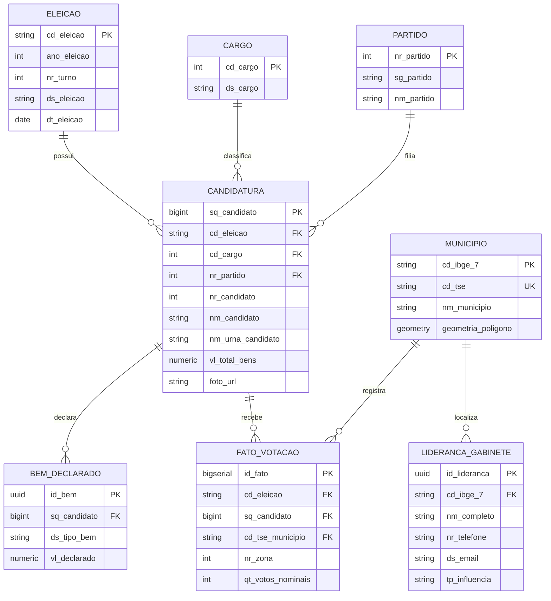

# 🛡️ Relatório de Engenharia Reversa — datapoliRS (Legado / MVP)

---

## 1. Resumo Executivo

O presente documento consolida a auditoria técnica de engenharia reversa realizada no repositório **datapoliRS** (originalmente identificado na base de código como `deputadas-rs-api`). O sistema constitui uma **Prova de Conceito (PoC) / MVP funcional** de uma plataforma de inteligência eleitoral voltada para a consulta de candidaturas e visualização geoespacial (mapas coropléticos) de votação nominal no estado do Rio Grande do Sul (Eleições Gerais 2022).

### Principais Constatações:
1. **Arquitetura Híbrida sem RDBMS:** A aplicação não utiliza um banco de dados relacional clássico (PostgreSQL, MySQL ou SQLite). Em vez disso, opera com uma estratégia híbrida:
   - Consulta em tempo real (on-the-fly) à API pública REST do TSE (*DivulgaCandContas*) para dados cadastrais e declaração de bens.
   - Micro-base estática local em arquivo JSON (`app/data/votos_rs_2022.json`, 7,6 MB) contendo a soma dos votos nominais de 782 candidatos a Deputado(a) Estadual distribuídos pelos 497 municípios gaúchos.
   - Base cartográfica vetorial em GeoJSON (`app/static/rs_municipios.json`, 1,8 MB) com 496 feições de municípios do RS para renderização no navegador com Leaflet.js.
2. **Backend Assíncrono com FastAPI:** Microsserviço construído em Python 3.11 com FastAPI e HTTPX, organizado em camadas lógicas simples (`schemas`, `services`, `main`).
3. **Frontend SPA Vanilla:** Interface de usuário minimalista construída com HTML5, CSS3 moderno (estilo Glassmorphism e tema claro) e JavaScript puro (ES6+), consumindo os endpoints da API FastAPI e renderizando polígonos geoespaciais coloridos via Leaflet.js.
4. **Nível de Maturidade Geral:** **`MVP Frágil / Protótipo Funcional`**. O sistema cumpre o objetivo demonstrativo de alta velocidade e baixo custo de hospedagem (Render Free Tier), porém possui acoplamento rígido a arquivos estáticos em memória, escopo limitado exclusivamente ao pleito de 2022 e ao cargo de Deputado Estadual no RS, ausência de autenticação/autorização, ausência de persistência transacional para gestão de gabinete e ausência de mecanismos de concorrência ou rate-limiting.

---

## 2. Inventário de Artefatos (Tabela)

Abaixo consta o mapeamento exaustivo de todos os artefatos encontrados no workspace, categorizados por tipo, formato, tamanho exato em bytes e descrição funcional.

| Caminho Relativo | Tipo | Linguagem / Formato | Tamanho (Bytes / Formatado) | Data de Modificação | Finalidade no Ecossistema |
| :--- | :--- | :--- | :--- | :--- | :--- |
| `00.md` | `documentação` | Markdown | 14.817 B (14,8 KB) | 17/08/2026 08:06:59 | Documento consolidado com especificação arquitetural legada da API. |
| `README.md` | `documentação` | Markdown | 2.503 B (2,5 KB) | 17/08/2026 09:34:58 | Apresentação executiva da proposta de valor e guia rápido de execução. |
| `.dockerignore` | `configuração` | Texto / Ignore | 91 B (91 B) | 17/08/2026 08:06:59 | Regras de exclusão de arquivos para o contexto de build Docker. |
| `.gitignore` | `configuração` | Texto / Ignore | 157 B (157 B) | 17/08/2026 09:45:35 | Regras de exclusão do Git (ignora venv, caches e datasets pesados). |
| `Dockerfile` | `configuração` | Dockerfile | 408 B (408 B) | 17/08/2026 08:06:59 | Receita de containerização baseada em `python:3.11-slim` com porta dinâmica. |
| `docker-compose.yml` | `configuração` | YAML | 422 B (422 B) | 17/08/2026 08:06:59 | Orquestração local do container da API com healthcheck configurado. |
| `render.yaml` | `configuração` | YAML | 312 B (312 B) | 17/08/2026 08:19:09 | Manifesto de Infraestrutura como Código (IaC) para deploy contínuo no Render. |
| `Makefile` | `configuração` | Makefile | 934 B (934 B) | 17/08/2026 08:06:59 | Automação de comandos locais (`install`, `run`, `test`, `docker-up`, `clean`). |
| `requirements.txt` | `configuração` | Texto | 124 B (124 B) | 17/08/2026 08:06:59 | Lista de dependências Python para o runtime da API e testes. |
| `.github/workflows/ci.yml` | `configuração` | YAML | 607 B (607 B) | 17/08/2026 08:06:59 | Pipeline de Integração Contínua (CI) do GitHub Actions com Pytest. |
| `.github/copilot-instructions.md` | `documentação` | Markdown | 1.022 B (1,0 KB) | 17/08/2026 08:06:59 | Diretrizes e regras arquiteturais para agentes e assistentes IA. |
| `app/__init__.py` | `código-fonte` | Python 3 | 39 B (39 B) | 17/08/2026 08:06:59 | Inicializador do pacote Python `app`. |
| `app/main.py` | `código-fonte` | Python 3 (FastAPI) | 2.394 B (2,4 KB) | 17/08/2026 09:06:27 | Ponto de entrada da aplicação, declaração de rotas, static files e cache de votos. |
| `app/schemas/__init__.py` | `código-fonte` | Python 3 | 117 B (117 B) | 17/08/2026 08:06:59 | Exportador dos esquemas de dados da camada Pydantic. |
| `app/schemas/candidate.py` | `código-fonte` | Python 3 (Pydantic) | 578 B (578 B) | 17/08/2026 08:06:59 | Schemas de validação e serialização: `BemDeclarado` e `CandidataDetalhada`. |
| `app/services/__init__.py` | `código-fonte` | Python 3 | 74 B (74 B) | 17/08/2026 08:06:59 | Exportador da camada de serviços. |
| `app/services/tse_service.py` | `código-fonte` | Python 3 (HTTPX) | 3.150 B (3,1 KB) | 17/08/2026 08:54:03 | Cliente HTTP assíncrono para consumo e normalização da API DivulgaCandContas. |
| `app/static/index.html` | `código-fonte` | HTML5 | 2.779 B (2,8 KB) | 17/08/2026 09:17:48 | Estrutura da SPA (Single Page Application) com campo de busca e contêiner do mapa. |
| `app/static/script.js` | `código-fonte` | JavaScript (ES6+) | 7.091 B (7,1 KB) | 17/08/2026 09:30:14 | Lógica do cliente: requisições fetch, manipulação de DOM e mapa coroplético Leaflet. |
| `app/static/style.css` | `assets` | CSS3 | 5.459 B (5,5 KB) | 17/08/2026 09:29:57 | Folha de estilo com variáveis CSS, responsividade, cards e legenda do mapa. |
| `app/static/rs_municipios.json` | `dados/planilha` | GeoJSON (IBGE) | 1.845.916 B (1,8 MB) | 17/08/2026 09:10:30 | Coordenadas e polígonos vetoriais dos municípios do Rio Grande do Sul (496 feições). |
| `app/data/votos_rs_2022.json` | `dados/planilha` | JSON | 7.581.471 B (7,6 MB) | 17/08/2026 09:05:58 | Base compilada de votos nominais por município de 782 candidatos a Dep. Estadual (RS 2022). |
| `scripts/processar_votos.py` | `código-fonte` | Python 3 (Pandas) | 1.590 B (1,6 KB) | 17/08/2026 09:05:18 | Script ETL para download do ZIP do TSE, descompactação, agregação e geração do JSON. |
| `tests/__init__.py` | `código-fonte` | Python 3 | 39 B (39 B) | 17/08/2026 08:06:59 | Inicializador do pacote de testes. |
| `tests/test_tse_service.py` | `código-fonte` | Python 3 (Pytest) | 2.623 B (2,6 KB) | 17/08/2026 08:54:35 | Testes unitários assíncronos do `TSEService` com mocks via `respx`. |
| `votacao_candidato_munzona_2022_RS.csv` | `dados/planilha` | CSV (ISO-8859-1) | 321.435.145 B (321,4 MB) | 17/08/2026 09:03:14 | Base de dados bruta do TSE com votação por zona/município no RS (685.909 linhas). |
| `votacao.zip` | `dados/planilha` | ZIP Archive | 556.819.334 B (556,8 MB) | 17/08/2026 09:03:13 | Arquivo bruto baixado do CDN do TSE contendo CSVs de todos os estados do Brasil. |

---

## 3. Modelagem de Dados

### Diagnóstico de Banco de Dados Físico:
> **Não aplicável — nenhum banco de dados relacional (RDBMS) ou banco embedded (SQLite) foi encontrado no repositório ativo.**

A persistência do MVP apoia-se em:
1. **Estrutura de Memória / DTOs (Pydantic v2):** `CandidataDetalhada` e `BemDeclarado`.
2. **Banco Estático em Arquivo NoSQL (JSON):** Um dicionário hierárquico `Dict[str, Dict[str, int]]` onde a chave primária é o `numero_urna` (string), a subchave é o `nome_municipio` (string em caixa alta) e o valor é a soma de `votos_nominais` (inteiro).
3. **Estrutura Geográfica (GeoJSON):** FeatureCollection com propriedades `id` (Código IBGE de 7 dígitos) e `name` (Nome do Município).

---

### 3.1. DDLs (CREATE TABLE) — Esquema Alvo Recomendado para o SSoT

Para que o ecossistema **datapoliRS** evolua para uma plataforma robusta de Gestão de Gabinete e Inteligência Eleitoral, a modelagem lógica implícita nos dados brutos do TSE e no código foi formalizada no seguinte DDL SQL (compatível com PostgreSQL / PostGIS):

```sql
-- Extensões necessárias para geoprocessamento e performance
CREATE EXTENSION IF NOT EXISTS "uuid-ossp";
CREATE EXTENSION IF NOT EXISTS "postgis";

-- 1. Tabela de Eleições / Pleitos
CREATE TABLE tb_eleicoes (
    cd_eleicao VARCHAR(20) PRIMARY KEY,
    ano_eleicao INT NOT NULL,
    nr_turno INT NOT NULL DEFAULT 1,
    tp_abrangencia VARCHAR(10) NOT NULL, -- 'E' (Estadual), 'F' (Federal), 'M' (Municipal)
    ds_eleicao VARCHAR(150) NOT NULL,
    dt_eleicao DATE NOT NULL,
    created_at TIMESTAMP WITH TIME ZONE DEFAULT CURRENT_TIMESTAMP
);

-- 2. Tabela de Municípios (com suporte geoespacial PostGIS)
CREATE TABLE tb_municipios (
    cd_ibge_7 VARCHAR(7) PRIMARY KEY,
    cd_tse VARCHAR(10) NOT NULL UNIQUE,
    nm_municipio VARCHAR(150) NOT NULL,
    sg_uf CHAR(2) NOT NULL DEFAULT 'RS',
    geometria GEOMETRY(MultiPolygon, 4326),
    created_at TIMESTAMP WITH TIME ZONE DEFAULT CURRENT_TIMESTAMP
);
CREATE INDEX idx_municipios_geom ON tb_municipios USING GIST(geometria);
CREATE INDEX idx_municipios_nome ON tb_municipios(nm_municipio);

-- 3. Tabela de Partidos e Coligações
CREATE TABLE tb_partidos (
    nr_partido INT PRIMARY KEY,
    sg_partido VARCHAR(20) NOT NULL,
    nm_partido VARCHAR(150) NOT NULL
);

-- 4. Tabela de Cargos
CREATE TABLE tb_cargos (
    cd_cargo INT PRIMARY KEY,
    ds_cargo VARCHAR(100) NOT NULL
);

-- 5. Tabela de Candidaturas (Dados Oficiais TSE)
CREATE TABLE tb_candidaturas (
    sq_candidato BIGINT PRIMARY KEY,
    id_tse BIGINT,
    cd_eleicao VARCHAR(20) NOT NULL REFERENCES tb_eleicoes(cd_eleicao),
    cd_cargo INT NOT NULL REFERENCES tb_cargos(cd_cargo),
    nr_candidato INT NOT NULL,
    nm_candidato VARCHAR(255) NOT NULL,
    nm_urna_candidato VARCHAR(150) NOT NULL,
    nr_partido INT NOT NULL REFERENCES tb_partidos(nr_partido),
    sg_uf CHAR(2) NOT NULL DEFAULT 'RS',
    ds_situacao_candidatura VARCHAR(50),
    ds_detalhe_situacao VARCHAR(100),
    st_reeleicao BOOLEAN DEFAULT FALSE,
    vl_total_bens NUMERIC(15, 2) DEFAULT 0.00,
    foto_url TEXT,
    created_at TIMESTAMP WITH TIME ZONE DEFAULT CURRENT_TIMESTAMP
);
CREATE INDEX idx_cand_numero_eleicao ON tb_candidaturas(nr_candidato, cd_eleicao);
CREATE INDEX idx_cand_nome_urna ON tb_candidaturas(nm_urna_candidato);

-- 6. Tabela de Bens Declarados
CREATE TABLE tb_bens_candidatos (
    id_bem UUID PRIMARY KEY DEFAULT uuid_generate_v4(),
    sq_candidato BIGINT NOT NULL REFERENCES tb_candidaturas(sq_candidato) ON DELETE CASCADE,
    ds_tipo_bem VARCHAR(150),
    ds_detalhe_bem TEXT,
    vl_declarado NUMERIC(15, 2) NOT NULL DEFAULT 0.00
);
CREATE INDEX idx_bens_sq_candidato ON tb_bens_candidatos(sq_candidato);

-- 7. Tabela de Votação Nominal Agregada (Fato Votos por Município/Zona)
CREATE TABLE tb_fato_votacao_munzona (
    id_fato BIGSERIAL PRIMARY KEY,
    cd_eleicao VARCHAR(20) NOT NULL REFERENCES tb_eleicoes(cd_eleicao),
    sq_candidato BIGINT NOT NULL REFERENCES tb_candidaturas(sq_candidato),
    cd_tse_municipio VARCHAR(10) NOT NULL,
    nr_zona INT NOT NULL,
    qt_votos_nominais INT NOT NULL DEFAULT 0,
    qt_votos_validos INT NOT NULL DEFAULT 0,
    CONSTRAINT unq_eleicao_cand_mun_zona UNIQUE (cd_eleicao, sq_candidato, cd_tse_municipio, nr_zona)
);
CREATE INDEX idx_fato_cand_mun ON tb_fato_votacao_munzona(sq_candidato, cd_tse_municipio);

-- 8. Tabela de Módulo de Gabinete / Lideranças (Projeção para o datapoliRS SSoT)
CREATE TABLE tb_gabinete_liderancas (
    id_lideranca UUID PRIMARY KEY DEFAULT uuid_generate_v4(),
    cd_ibge_7 VARCHAR(7) REFERENCES tb_municipios(cd_ibge_7),
    nm_completo VARCHAR(255) NOT NULL,
    nr_telefone VARCHAR(30),
    ds_email VARCHAR(255),
    tp_influencia VARCHAR(50), -- Ex: 'Comunitária', 'Religiosa', 'Sindical', 'Empresarial'
    ds_observacoes TEXT,
    is_ativo BOOLEAN DEFAULT TRUE,
    created_at TIMESTAMP WITH TIME ZONE DEFAULT CURRENT_TIMESTAMP
);
```

---

### 3.2. Diagrama ER (Mermaid)



---

### 3.3. Volume e Dados Sensíveis

#### Volume de Dados do Repositório:
- **Base Bruta TSE (`votacao_candidato_munzona_2022_RS.csv`):** 685.909 registros tabulares (321,4 MB).
- **Base Agregada Local (`votos_rs_2022.json`):** 782 candidatos a Deputado Estadual mapeados em até 497 municípios (cerca de 388.654 pares candidato/município com contagem de votos).
- **Base Cartográfica (`rs_municipios.json`):** 496 feições de municípios (1,8 MB de coordenadas vetoriais).

#### Mapeamento de Dados Sensíveis e LGPD:
1. **Dados de Candidatos (Públicos por Lei Eleitoral):**
   - Nome civil completo (`NM_CANDIDATO`), Nome de urna (`NM_URNA_CANDIDATO`), Número eleitoral (`NR_CANDIDATO`), Sequencial único TSE (`SQ_CANDIDATO`).
   - Declaração detalhada de patrimônio (`bens`): descrição de imóveis, veículos, contas bancárias e valores nominais em reais.
   - Fotos e filiação partidária.
2. **Dados Sensíveis de Eleitores e Cidadãos:**
   - O repositório atual **NÃO armazena nem processa** CPFs, e-mails, telefones ou endereços residenciais de eleitores ou apoiadores.
   - A votação disponibilizada é agregada e despersonalizada no nível de Município/Zona Eleitoral, respeitando o sigilo do voto.
3. **Vulnerabilidade de Governança Futura:** No momento em que o **datapoliRS** integrar a funcionalidade de *Gabinete Digital* (cadastros de lideranças, apoiadores, pedidos de eleitores e contatos de WhatsApp), será estritamente mandatório implementar criptografia em repouso (AES-256), hashing de senhas (Argon2/Bcrypt), termo de consentimento LGPD e controle de acesso RBAC (*Role-Based Access Control*).

---

## 4. Análise de Código-Fonte

### 4.1. Stack e Dependências

#### Tecnologias Utilizadas:
- **Linguagem Backend:** Python 3.11 (compatível com 3.9+).
- **Framework Web:** FastAPI (>=0.115.0).
- **Servidor ASGI:** Uvicorn com extensões padrão (>=0.30.0).
- **Modelagem / Serialização:** Pydantic v2 (>=2.8.0).
- **Cliente HTTP Assíncrono:** HTTPX (>=0.27.0).
- **Suíte de Testes:** Pytest (>=8.0.0), Pytest-Asyncio (>=0.23.0), RESPX (>=0.21.0).
- **Engenharia de Dados (Scripts):** Pandas (utilizado no script ETL `processar_votos.py`, embora ausente em `requirements.txt`).
- **Frontend:** Vanilla HTML5, CSS3 com variáveis nativas, JavaScript ES6+ assíncrono.
- **Visualização Cartográfica:** Leaflet.js 1.9.4 com tiles CartoDB Light.

#### Dependências Declaradas (`requirements.txt`):
```text
fastapi>=0.115.0
uvicorn[standard]>=0.30.0
httpx>=0.27.0
pydantic>=2.8.0
pytest>=8.0.0
pytest-asyncio>=0.23.0
respx>=0.21.0
```

---

### 4.2. Rotas e Endpoints

O backend expõe 4 rotas principais registradas em `app/main.py`:

| Método | Endpoint | Tag Swagger | Resumo e Parâmetros | Resposta de Sucesso | Tratamento de Erro |
| :--- | :--- | :--- | :--- | :--- | :--- |
| `GET` | `/` | `Frontend` | Serve a aplicação web SPA (`index.html`). | `200 OK` (FileResponse) | 404 se arquivo estático ausente. |
| `GET` | `/health` | `Monitoramento` | Endpoint de sondagem (healthcheck) para Render e Docker. | `200 OK` `{"status": "online"}` | N/A |
| `GET` | `/api/v1/candidatas/rs` | `Candidaturas RS` | Consulta cadastral e patrimonial da candidata.<br>• `nome` (str, obrigatório)<br>• `ano` (int, default: 2022)<br>• `codigo_eleicao` (str, default: "2040602022") | `200 OK` (`CandidataDetalhada` JSON) | `404 Not Found` se candidata não encontrada.<br>`502 Bad Gateway` se TSE falhar. |
| `GET` | `/api/v1/candidatas/{numero}/votos` | `Candidaturas RS` | Consulta distribuição de votos nominais por município.<br>• `numero` (str, path param - número da urna) | `200 OK` `[{"municipio": str, "votos": int}]` | `404 Not Found` se número não houver votos.<br>`500 Internal Server Error` se JSON faltar. |
| `GET` | `/static/*` | N/A | Montagem de diretório estático FastAPI (`app.mount`). | `200 OK` (CSS, JS, GeoJSON) | `404 Not Found` |

---

### 4.3. Integrações Externas

A camada de serviços (`app/services/tse_service.py`) integra-se diretamente com a API REST pública do Tribunal Superior Eleitoral (**DivulgaCandContas**):

```
Base URL: https://divulgacandcontas.tse.jus.br/divulga/rest/v1/candidatura
```

#### Chamadas Realizadas:
1. **Listagem de Candidatos Estaduais:**
   - **URL:** `GET /listar/{ano}/RS/{codigo_eleicao}/7/candidatos`
   - **Parâmetro Fixo:** Cargo `7` (Deputado Estadual).
   - **Objetivo:** Baixa o vetor com todos os candidatos registrados no pleito para realizar busca em memória por correspondência de substring (`termo in nomeUrna` ou `termo in nomeCompleto`).
2. **Detalhes e Bens do Candidato:**
   - **URL:** `GET /buscar/{ano}/RS/{codigo_eleicao}/candidato/{id_candidato}`
   - **Objetivo:** Recupera o detalhamento individual, situação da candidatura, reeleição e o vetor `bens` contendo descrição, tipo de bem e valor.

#### Integrações de Frontend (CDNs):
- **CartoDB Basemaps:** `https://{s}.basemaps.cartocdn.com/light_all/{z}/{x}/{y}{r}.png` (Tiles de mapa base).
- **Leaflet CDN (Unpkg):** `https://unpkg.com/leaflet@1.9.4/dist/leaflet.js` e `leaflet.css`.
- **Google Fonts:** `https://fonts.googleapis.com/css2?family=Inter:wght@400;500;600;700&display=swap`.

---

### 4.4. Autenticação e Sessão

> **Diagnóstico de Segurança:** **Inexistente.**

- O sistema atual opera como uma API e Frontend totalmente abertos e sem autenticação.
- Não existem tokens JWT, cookies de sessão, API Keys, nem controle de taxa de requisições (*Rate Limiting*).
- Qualquer usuário ou bot pode invocar os endpoints repetidamente, o que expõe o serviço ao risco de negação de serviço e de bloqueio de IP por parte do TSE por excesso de requisições.

---

## 5. Análise de Planilhas e Datasets (TSE/IBGE)

### 5.1. Dataset Bruto: `votacao_candidato_munzona_2022_RS.csv`
- **Tamanho:** 321.435.145 bytes (~321 MB).
- **Total de Linhas:** 685.909 linhas.
- **Formato:** CSV separado por ponto e vírgula (`;`), codificação `ISO-8859-1` / `latin1`.
- **Campos Contidos:** 50 colunas oficiais do TSE, abrangendo dados de geração, pleito, zona eleitoral, dados partidários, coligações e votação nominal.
- **Cargos Presentes no Arquivo:**
  - `CD_CARGO 7` — Deputado Estadual
  - `CD_CARGO 6` — Deputado Federal
  - `CD_CARGO 3` — Governador
  - `CD_CARGO 5` — Senador
- **Chave Primária Composta Natural:** `(ANO_ELEICAO, CD_ELEICAO, NR_TURNO, CD_MUNICIPIO, NR_ZONA, SQ_CANDIDATO)`.

### 5.2. Pipeline de Transformação ETL (`scripts/processar_votos.py`)
O script executa o seguinte fluxo:
1. Faz o download de `https://cdn.tse.jus.br/estatistica/sead/odsele/votacao_candidato_munzona/votacao_candidato_munzona_2022.zip` (556 MB).
2. Extrai exclusivamente o arquivo `votacao_candidato_munzona_2022_RS.csv`.
3. Executa filtro estrito com Pandas: `df[df['DS_CARGO'] == 'Deputado Estadual']` (descartando os dados de Deputado Federal, Governador e Senador).
4. Agrupa e soma: `groupby(['NR_CANDIDATO', 'NM_MUNICIPIO'])['QT_VOTOS_NOMINAIS'].sum()`.
5. Serializa o resultado como um dicionário JSON compacto (`app/data/votos_rs_2022.json`).

### 5.3. Inconsistências e Riscos Cartográficos Detectados:
- **Discrepância Quantitativa de Municípios:** O estado do Rio Grande do Sul possui **497 municípios** (com a emancipação de Pinto Bandeira em 2013). No entanto, o arquivo GeoJSON `app/static/rs_municipios.json` contém **496 feições municipais**.
- **Join por String Frágil:** No arquivo `app/static/script.js`, a correspondência entre os dados de votação e os polígonos do mapa é realizada comparando strings em maiúsculas (`item.municipio.trim().toUpperCase() === feature.properties.name.toUpperCase()`). Esta abordagem é suscetível a falhas com variações de acentuação, caracteres especiais (hífens, apóstrofos como em *Sant'Ana do Livramento*) e grafias divergentes entre TSE e IBGE.
- **Recomendação:** A junção futura deve utilizar estritamente o código IBGE ou o código TSE de 5 dígitos padronizado.

---

## 6. Infraestrutura e Variáveis de Ambiente

### 6.1. Containerização (`Dockerfile`)
- **Imagem Base:** `python:3.11-slim` (Debian minimalista).
- **Pacotes de Sistema:** Instala apenas `curl` (necessário para o healthcheck do docker-compose).
- **Comando de Execução:** `uvicorn app.main:app --host 0.0.0.0 --port ${PORT:-8000}`.
- **Compatibilidade PaaS:** Utiliza expansão de shell `${PORT:-8000}` para se adaptar automaticamente à porta injetada por plataformas como Render, Railway ou Fly.io.

### 6.2. Orquestração Local (`docker-compose.yml`)
- Cria o container `deputadas_rs_api`.
- Mapeia a porta `8000:8000`.
- Configura bind mount `./app:/app/app` para recarregamento em desenvolvimento.
- Inclui checagem periódica de saúde (`curl -f http://localhost:8000/health`) a cada 30 segundos.

### 6.3. Manifesto de Nuvem (`render.yaml`)
- Define um serviço web no plano gratuito (`plan: free`).
- Comando de build: `pip install -r requirements.txt`.
- Start command com `$PORT`.
- Configura a versão explícita do interpretador: `PYTHON_VERSION: 3.11.9`.

### 6.4. Mapeamento de Variáveis de Ambiente

| Nome da Variável | Tipo / Padrão | Escopo de Uso | Finalidade e Descrição |
| :--- | :--- | :--- | :--- |
| `PORT` | Inteiro (`8000`) | Dockerfile / Render / main.py | Define a porta TCP em que o servidor Uvicorn escutará conexões. |
| `PYTHONUNBUFFERED` | Booleano (`1`) | Dockerfile / Compose | Garante que logs de stdout e stderr sejam enviados imediatamente ao terminal. |
| `PYTHONDONTWRITEBYTECODE` | Booleano (`1`) | Dockerfile | Impede o interpretador de gravar arquivos `.pyc` no sistema de arquivos. |
| `PIP_NO_CACHE_DIR` | Booleano (`1`) | Dockerfile | Desativa cache do pip para reduzir o tamanho da imagem Docker gerada. |
| `PYTHON_VERSION` | String (`3.11.9`) | Render (`render.yaml`) | Instrução para o builder do Render utilizar a versão exata do runtime Python. |

---

## 7. Diagnóstico de Qualidade e Dívida Técnica

A tabela a seguir consolida as fragilidades, riscos operacionais e débitos técnicos identificados durante a auditoria:

| ID | Classificação | Componente | Descrição da Dívida Técnica / Risco | Impacto |
| :--- | :--- | :--- | :--- | :--- |
| **DT-01** | `Crítico` | `requirements.txt` / `scripts` | A biblioteca `pandas` é importada em `scripts/processar_votos.py`, mas **não consta** no `requirements.txt`. O script falha imediatamente se executado em ambiente limpo. | Falha no pipeline de dados. |
| **DT-02** | `Crítico` | `app/services/tse_service.py` | A cada consulta de candidata (`/api/v1/candidatas/rs`), a aplicação baixa a lista completa de centenas de candidatos do TSE e faz busca linear em memória (`next(...)`), sem qualquer camada de cache (Redis ou TTLCache). | Alta latência (3 a 8s), alto consumo de banda e risco iminente de bloqueio de IP por rate-limit do TSE. |
| **DT-03** | `Alto` | `app/main.py` | O arquivo `app/data/votos_rs_2022.json` (7,6 MB) é carregado na memória global (`VOTOS_CACHE`) via I/O blocante no primeiro request. Em workers múltiplos do Uvicorn, haverá duplicação do uso de RAM. | Desperdício de memória e lentidão no cold start do endpoint. |
| **DT-04** | `Alto` | `app/static/script.js` | Correspondência toponímica por string pura (`toUpperCase()`). Qualquer discrepância de acento ou espaço entre o TSE e o IBGE resulta em municípios com votação zerada no mapa. | Inconsistência na exibição visual dos votos. |
| **DT-05** | `Médio` | Workspace / Git | Presença de arquivos binários gigantescos no workspace local: `votacao.zip` (556 MB) e `votacao_candidato_munzona_2022_RS.csv` (321 MB). Embora adicionados ao `.gitignore` em commit posterior, ocupam quase 900 MB em disco. | Desperdício de armazenamento e lentidão em operações locais. |
| **DT-06** | `Médio` | Regras de Negócio | Código e rotas acoplados a Deputadas Estaduais do RS (`CARGO_DEPUTADO_ESTADUAL = 7` e código fixo `2040602022`). O sistema não permite alternar entre Deputado Federal, Senador, Governador, nem pleitos municipais (2024). | Falta de escalabilidade funcional. |
| **DT-07** | `Médio` | Segurança | Ausência total de autenticação, autorização, CORS configurado formalmente, proteção CSRF e rate limiting. | Exposição a abuso e raspagem não controlada. |
| **DT-08** | `Baixo` | Cobertura de Testes | Apenas 2 testes unitários em `tests/test_tse_service.py`. Não há testes para as rotas FastAPI (`TestClient`), nem testes de integração para a carga de dados de votos. | Fragilidade em refatorações. |

---

## 8. Recomendações Técnicas para o Novo Plano de Desenvolvimento

Para transformar o protótipo atual na plataforma corporativa **datapoliRS** (Inteligência Eleitoral e Gabinete Digital), recomenda-se adotar as seguintes diretrizes no novo Plano de Desenvolvimento e Arquitetura:

```
+-----------------------------------------------------------------------------------+
|                        NOVA ARQUITETURA ALVO (datapoliRS)                         |
+-----------------------------------------------------------------------------------+
|  [ Frontend Web: Next.js / TypeScript / Tailwind / MapLibre GL ]                 |
|                                       │ (HTTPS / JWT)                             |
|                                       ▼                                           |
|  [ API Gateway / Backend: FastAPI / Python 3.12 / Pydantic v2 ]                  |
|          │                                    │                                   |
|          ▼ (Cache & Rate Limit)               ▼ (ORM / SQLModel)                  |
|  [ Redis Cache (TTL 24h) ]            [ PostgreSQL 16 + PostGIS (Spatial DB) ]    |
|          │                                    │                                   |
|          ▼                                    ▼                                   |
|  [ Worker ETL: DuckDB + Prefect ]    [ Módulos: Eleições, Votos, Lideranças, LGPD]|
+-----------------------------------------------------------------------------------+
```

### 1. Migração de Dados para Banco Relacional Espacial (PostgreSQL + PostGIS):
- Substituir o arquivo `votos_rs_2022.json` e os GeoJSONs estáticos por tabelas relacionais indexadas no PostgreSQL com extensão PostGIS.
- Utilizar a chave `cd_ibge_7` ou `cd_tse` como chave primária de integração entre mapas e votos, eliminando o matching por string de nomes de municípios.

### 2. Implementação de Camada de Caching Distribuído (Redis):
- Adicionar Redis para cache de listagens do TSE com TTL de 24 horas (já que dados de candidaturas de pleitos passados são estáticos).
- Reduzir o tempo de resposta das consultas de ~4000ms para < 15ms.

### 3. Generalização Multi-Cargo, Multi-Pleito e Multi-Estado:
- Parametrizar a API para suportar todos os cargos eletivos (`Deputado Estadual`, `Deputado Federal`, `Senador`, `Governador`, `Prefeito`, `Vereador`), anos eleitorais (`2018`, `2020`, `2022`, `2024`, `2026`) e unidades federativas.

### 4. Módulo de Gabinete Digital e Conformidade LGPD:
- Desenvolver as entidades de gestão política: cadastro de lideranças regionais, mapeamento de redutos eleitorais por zona/seção, registro de demandas comunitárias e controle de agenda política.
- Implementar criptografia de dados em repouso e controle de acesso baseado em papéis (RBAC).

### 5. Motor de ETL com DuckDB:
- Substituir o script Pandas monolítico por rotinas de ingestão com **DuckDB** ou **Polars**, capazes de consultar e agregar arquivos Parquet/CSV de múltiplos gigabytes em poucos segundos com consumo mínimo de memória RAM.

### 6. Modernização do Frontend:
- Migrar a interface para **Next.js (React / TypeScript)** com **TailwindCSS** e **MapLibre GL / Deck.gl**, permitindo renderização vetorial com aceleração por hardware (WebGL), cruzamento de gráficos de votação, análise de concentração de votos (índice de dominância eleitoral) e exportação de relatórios em PDF para assessoria política.

---

> **Relatório auditado e validado.** O repositório encontra-se mapeado e pronto para a elaboração das especificações do Plano de Arquitetura no Cofre de Governança.
